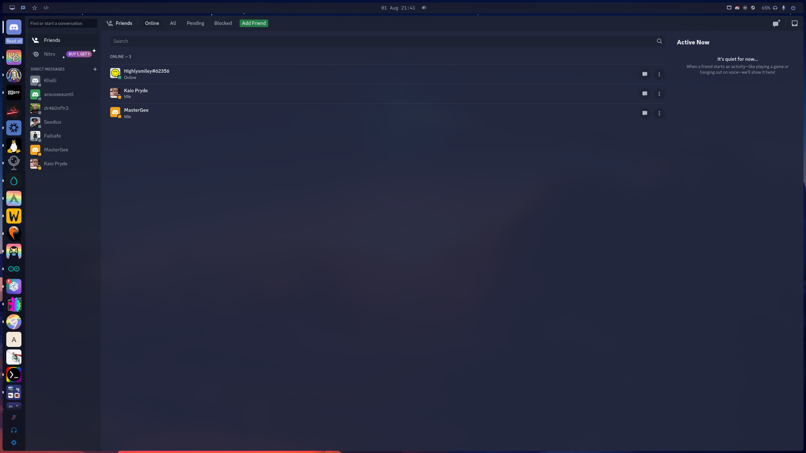

<h1 align="center">IgguT/nixos-config</h1>

This repository contains a [Nix Flake](https://nixos.wiki/wiki/Flakes) for configuring my machines.

The machines configured thus far are:

| Hostname  |          Model          |   OS   |  Role   | Desktop  |   Who    |
| :-------: | :---------------------: | :----: | :-----: | :------: | :------: |
|   `dev`   |     [Multipass] VM      | Ubuntu | Server  |    -     | not mine |
|  `gs66`   |      MIS GS66 10se      | NixOS  | Laptop  | Hyprland |   mine   |
|  `hugin`  | Lenovo Thinkcentre M93p | NixOS  | Server  |    -     | not mine |
| `gaminix` | Intel/cpu - Nvidia/gpu  | NixOS  | Desktop | Hyprland |   mine   |
|  `thor`   |     Intel NUC6i7KYK     | NixOS  | Server  |    -     | not mine |

# 🗒️ About

Strap on your NixOS install USB, ISO, or any storage device of your fancy, grab a cold beer, and brace yourself for a wild ride of error fixing! It's like a rollercoaster for tech enthusiasts, where the screams of frustration are drowned out by the clinking of beer bottles. But fear not, for with each error conquered, you'll emerge stronger, wiser, and perhaps a little tipsy. So, hop on this exhilarating journey, where code meets hops, and let's show those errors who's boss! Cheers to debugging adventures!
Boot the USB/ISO

1. **Clone + Username:**
   `git clone https://github.com/iggut/nixos-config.git`
   Change all occurances of `iggut` to your desired username.

2. **Partitioning**

   Disko now take care of this. Lucky you! Just make sure your drive is nvme0n1 since that is what will get destroyed by the install script. The disks (in hosts) file can be modified for the drive of your choosing.

3. **Sip**

   ```bash
   $sip your beer
   ```

4. **Install nixos from flake**
   Change all occurances of `iggut` to your desired username.
   ```bash
   $ bash install-with-disko HOSTNAME
   ```
   Change `HOSTNAME` to your desired hostname.
   ```bash
   $ sip your beer
   ```

## 🎉 Congratulations on reaching the end! 🎉

You've conquered the README quest like a true champion. Now, it's time to celebrate your victory with a well-deserved 🍺 refill. But before you kick back and enjoy, we have a few more steps for you. Get ready for the final showdown:

1. 🔄**Reboot**: Give your system a friendly kick and let it dance its way back to life.
2. 👑**Login**: Embrace your newfound power and access the realm of ultimate control.
3. 🔐**Change User Password**: Show that keyboard who's boss and set a new password for yourself (use `passwd iggut` or whichever password you changed it to).
4. 🚶‍♀️**Run HM and Enjoy**: Step back into the shoes of a humble user and bask in the glory of your triumph.
   ```bash
   home-manager switch --flake .#user@hostname
   ```

With these mighty steps complete, you can proudly declare yourself the hero of your digital kingdom. So, go forth, brave warrior, and may your adventures be filled with laughter, joy, and bug-free code! Enjoy the spoils of your victory!

## 🗃️ Contents

Luks encrypted full drive

- [home]: my home-manager configuration
- [host]: host-specific configurations
- [overlays]: package/configuration overlays
- [pkgs]: my custom package definitions
- [scripts]: helper scripts for machine setup

<!-- Applications / Packages -->

[alacritty]: ./home/common/desktop/alacritty.nix
[gtk]: ./home/common/desktop/gtk.nix
[hyprland]: ./home/common/desktop/hyprland/default.nix
[mako]: ./home/common/desktop/sway/services.nix
[neofetch]: ./home/common/shell/neofetch.nix
[nvim]: ./home/common/shell/vim.nix
[starship]: ./home/common/shell/starship.nix
[sway]: ./home/common/desktop/sway/default.nix
[swaylock]: ./home/common/desktop/sway/swaylock.nix
[tmux]: ./home/common/shell/tmux.nix
[vscode]: ./home/common/desktop/vscode.nix
[zathura]: ./home/common/desktop/zathura.nix
[waybar]: ./home/common/desktop/sway/waybar/default.nix
[zsh]: ./home/common/shell/zsh.nix

## 💻 Desktop preview





# 💾 Resources

Here are the sources of my inspiration and the ones I shamelessly copied (with a wink and a nod):

- [FitzHawke/soxyn](https://github.com/FitzHawke/soxyn) - The secret lair of flake utilities, unveiling the hidden powers of Nix!
- [nomadics9/NixOS-Flake](https://github.com/nomadics9/NixOS-Flake) - The magical toolbox that granted me superpowers.
- [benvonh/.snow](https://github.com/benvonh/.snow) - The realm of benvonh, where infrastructure bends to their will!
- [jnsgruk/nixos-config](https://github.com/jnsgruk/nixos-config) - The wise sage who shared their mystical Nix spells.
- [sioodmy/dotfiles](https://github.com/sioodmy/dotfiles) - The grand architect whose configurations reached for the Nix heavens.
- [fufexan/dotfiles](https://github.com/fufexan/dotfiles) - The mighty Nixos warrior whose battle-tested configurations fueled my inspiration.
- [dr460nf1r3/dr460nixed](https://github.com/dr460nf1r3/dr460nixed) - The Nix sorcerer who mesmerized me with their enchanting dotfiles.
- [IceDBorn/IceDOS](https://github.com/IceDBorn/IceDOS) - The kingdom of IceDBorn, where Nixos reigns supreme and configurations flourish!
- [Misterio77/nix-config](https://github.com/Misterio77/nix-config) - A treasure trove of dotfile sorcery, where the magic is in the details!

# 👥 People

These are the brilliant minds who have sprinkled their genius on my configurations. While I like to think that I came up with everything on my own, the truth is that inspiration struck from various sources. And although my memory might resemble a sieve when it comes to remembering everyone, my gratitude is boundless.

Behold, the amazing folks who have influenced and inspired me:

- The enigmatic fufexan
- The ingenious nomadics9
- The wizard of customization, sioodmy
- The legendary FitzHawke
- The mastermind known as benvonh
- The extraordinary jnsgruk
- The elusive IceDBorn
- The mysterious Misterio77
- The magnificent dr460nf1r3

To all of you, I extend my heartfelt thanks. Your brilliance has ignited my own creativity, and I am forever grateful for the influence you have had on my configurations.
